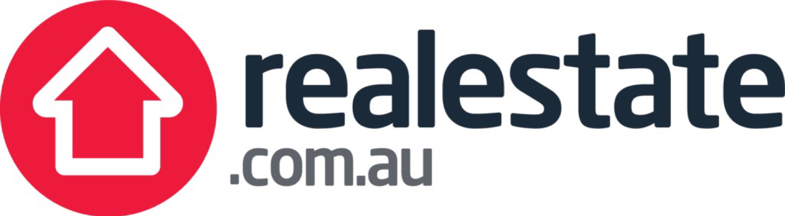
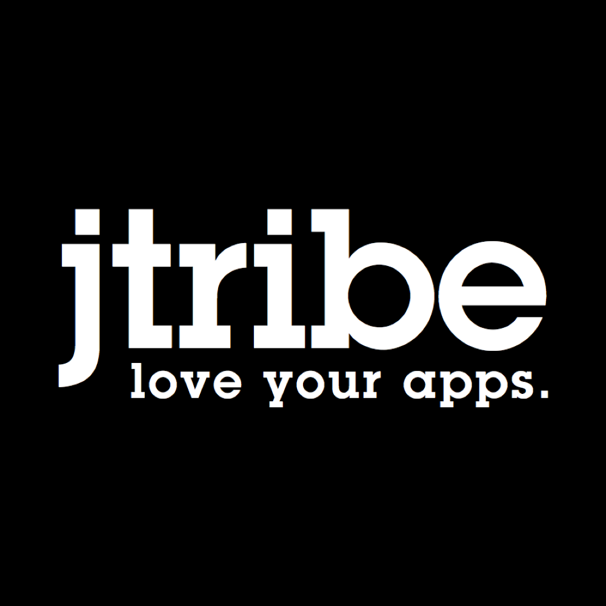

# Melbourne CocoaHeads
## Kicking off @ 6:30pm
### Join slack @ slack.melbournecocoaheads.com
### Twitter @melbournecocoa

---

# Welcome
# :wave:

---

# Welcome :wave:

- "Who's this guy?"
- Introduction to CocoaHeads
- Whats new in ~~iOS 18~~ 2018
- Tonight's agenda & sponsors
- "Who's hiring"

---

# Hi, I'm Jesse

- iOS developer for the last 7 years
- realestate.com.au, Beanhunter, RMIT
- Melbourne CocoaHeads organiser since ~2014
- I have a goal to start my own startup

---

#[FIT] Melbourne CocoaHeads
## Established 2007

---

> Melbourne CocoaHeads is a casual, independent meetup focused on iOS and macOS development and the surrounding eco system

---

# CocoaHeads Events

- Presentation Night
- Hack Night
- Drinks Night & NSBreakfast

---

# Presentation Night

- 2nd Thursday, 6pm-8:30pm
- :pizza: and drinks from 6pm
- 2x Lightning talks (15 mins)
- Main presentation (30 mins)
- Livestreamed to YouTube
- Hosted at YBF Ventures, 520 Bourke St

---

# Hack Night

- 3rd Wednesday, 6pm-8:30pm
- Introductions from 6:30pm
- BYO laptop and your iOS, macOS, tvOS or watchOS project
- Alchohol free, :pizza: provided
- Hosted at Aconex, 96 Flinders St

---

> Everyone is welcome to our all-ages alcohol-free event. Hosted in a professional environment to allow you to work on your project. Get help from industry experts who are on hand to help you out.

---

# Drinks Night & NSBreakfast

- Last Tuesday from 6pm (Drnks)
- First Friday from 7:30am (Breakfast)

---

# Getting Involved

- Attending
- Bringing a friend
- Speak on a topic of your choice
- Attend a Hack Night
- Volunteer your time

---

#[fit] meetup.com/Melbourne-CocoaHeads

---

# Finding CocoaHeads

- melbournecocoaheads.com
- @melbournecocoa
- slack.melbournecocoaheads.com
- melbournecocoaheads.com/live (YouTube)
- jesse@melbournecocoaheads.com

---

# What's new for 2018

---

# A More Concise Format

- Pizza from 6pm
- Finish by 8:30pm

---

# A New Hack Night

- All ages, alchohol free
- Professional, welcoming environment
- Introductions and ice-breaker tasks from 6:30
- Bring your project, get some help from others

---

# Code of Conduct

---

>Our community is dedicated to providing an inclusive environment for everyone, regardless of gender, gender identity and expression, age, sexual orientation, disability, physical appearance, body size, race, ethnicity, religion (or lack thereof), or technology choices.

---

#[fit] codeofconduct@melbournecocoaheads.com

---

## melbournecocoaheads.com/code-of-conduct

---

# Special Thanks

---

# Code of Conduct

- Jonny Sagorin
- Kate Lanyon
- Sean Woodhouse

---

# Hack Night

- Luke Tupper
- Stew Gleadow

---

# Speaker Wrangling

- Caroline Jones
- Ben Deckys
- Matt Delves

---

# Sponsorship Advice

- Luke Sleeman
- Rob Amos

---

# Meetup.com Coordination

- Marius Ursache

---

# Sponsorship Wrangling

- Prasana Gopalakrishnan
- Michael Fletcher

---

#[fit] One more thing

---

# Stickers!

---

# CocoaHeads Sponsors for 2018

---

# Major Sponsor

---

# Silver Sponsors

---

# 2018 Venue

## YBF Ventueres

---

# Tonight's Agenda

Time|Speaker|Topic|
---|---|---
6:40 - 6:45 | Who's Hiring | Your career |
6:45 - 7:00 | Gio | Why Slack Can Be Harmful
7:00 - 7:15 | Matt Delves | The Land Before Time (An AppKit Journey)
7:15 - 7:30 | Break
7:30 - 8:00 | Hon Weng Chong | An automated CoreML workflow for Natural Language Processing (NLP)

---

# Who's Hiring

---

# Presentations

---

# Next event - Hack Night
## February 21 @ Aconex from 6:00pm

---

# Next Meetup
## March 8 @ YBF Ventures from 6:00pm

---

# Thanks for Coming!
# melbournecocoaheads.com
