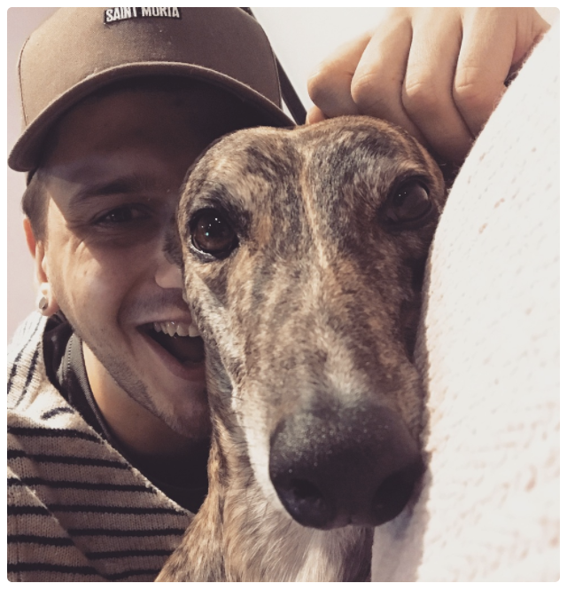

# Melbourne CocoaHeads
## Kicking off @ 6:30pm
### Join slack @ slack.melbournecocoaheads.com
### Twitter @melbournecocoa
### Stickers up front!
---

# Welcome
# :wave:

---

# Welcome :wave:

- "Who's this guy?"
- Upcoming CocoaHeads events
- Code of Conduct
- Tonight's agenda & sponsors
- The Month That Was
- Who's hiring

---

# Hi, I'm Ben

- iOS developer from 2008
- Eccentric
- @topLayoutGuide

---

# Upcoming Events

- Hack Night - 18 April
- Drinks Night - 24 April
- NSBreakfast - 4 May
- Presentation Night - 10 May

More info -> melbournecocoaheads.com/about

---

---

# Finding CocoaHeads

- melbournecocoaheads.com
- @melbournecocoa
- slack.melbournecocoaheads.com
- melbournecocoaheads.com/live (YouTube)
- jesse@melbournecocoaheads.com

---

# Code of Conduct

---

> Our community is dedicated to providing an inclusive environment for everyone, regardless of gender, gender identity and expression, age, sexual orientation, disability, physical appearance, body size, race, ethnicity, religion (or lack thereof), or technology choices.

---

## melbournecocoaheads.com/code-of-conduct

---

## codeofconduct@melbournecocoaheads.com

^ All complaints made in any of these ways will remain confidential, be taken seriously, investigated, and dealt with appropriately.

---

# Sponsors for 2018

---

# Major Sponsor

---

# Silver Sponsors

---

# 2018 Venue

---

# Tonight's Agenda

Time|Speaker|Topic|
---|---|---
6:00 - 6:30 | Arrival and :pizza: |
6:30 - 6:45 | Intro & Who's Hiring |
6:45 - 7:15 | Allen Zeng | Scaling iOS engineering at Xero |
7:15 - 7:30 | Break
7:30 - 8:00 | Jean Etienne | Introduction to Swift on the Server: How to share code between your apps and your APIs |

---

# The Month That Was
## April 2018

---

# Who's Hiring
## Follow up -> #jobs

---

# Presentations

---

# Next Hack Night
## April 18 @ Aconex from 6:00pm

---

# Next NSBreakfast
## April 4 @ Higher Ground from 7:30am

---

# Next Meetup
## May 10 @ YBF Ventures from 6:00pm

---

# Thanks for Coming!
# melbournecocoaheads.com
