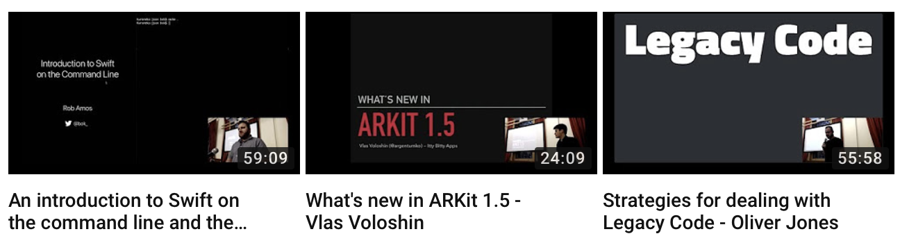

# Melbourne CocoaHeads
## June 14, 2018
### Join slack @ slack.melbournecocoaheads.com
### Twitter @melbournecocoa

---

# Melbourne CocoaHeads
## Kicking off @ 6:30pm
### Join slack @ slack.melbournecocoaheads.com
### Twitter @melbournecocoa
### Stickers up front!
---

# Welcome
# :wave:

---

# Welcome :wave:

- The Month That Was
- "Who's this guy?"
- Upcoming CocoaHeads events
- Code of Conduct
- Tonight's agenda & sponsors
- Who's hiring

---

# The Month That Was
## May 8 - June 14 - WWDC 2018

---

# WWDC 2018

 - iOS 12 - (ML, AR, Siri Extensions, Performance++, Screen Time)
 - MacOS Mojave - (Dark Mode, UIKit on macOS)
 - Xcode 10 - (Testing improvements, Swift 4.2, feelsgoodman.gif)

---

# Hi, I'm Jesse

- Developing for iOS since 2010
- realestate.com.au, Beanhunter, RMIT
- Melbourne CocoaHeads organiser since ~2014

---

# Upcoming Events

- Hack Night - June 20th @ IBM
- Drinks Night - June 26th
- NS Breakfast - July 6th

---

# Finding CocoaHeads

- melbournecocoaheads.com
- twitter.com/@melbournecocoa
- slack.melbournecocoaheads.com
- melbournecocoaheads.com/live (YouTube)
- jesse@melbournecocoaheads.com

---

# CocoaHeads on YouTube

 - melbournecocoaheads.com/live

---

# Code of Conduct

---

> Our community is dedicated to providing an inclusive environment for everyone, regardless of gender, gender identity and expression, age, sexual orientation, disability, physical appearance, body size, race, ethnicity, religion (or lack thereof), or technology choices.

---

## melbournecocoaheads.com/code-of-conduct

---

## codeofconduct@melbournecocoaheads.com

^ All complaints made in any of these ways will remain confidential, be taken seriously, investigated, and dealt with appropriately.

---

# Sponsors for 2018

---

# Major Sponsor

---

# Silver Sponsors

---

# 2018 Venue

---

# Tonight's Agenda

Time|Speaker|Topic|
---|---|---
6:00 - 6:30 | Arrival and :pizza:
6:30 - 6:40 | Intro & Who's Hiring
6:45 - 7:00 | Matt Delves | Mac OS Mojave Dark Mode
7:00 - 7:15 | Vlas Voloshin | Marzipan's Internals
7:10 - 7:30 | Break
7:30 - 8:00 | Barry Scott | Structure and Interpretation of Code Coverage

---

# Who's Hiring
## Follow up -> #jobs

---

# Presentations

---

# Next Hack Night :computer:
## June 20 @ IBM from 6:00pm

---

# Next Drinks Night :beers:
## June 26 @ The Mill House from 6:00pm

# Next NSBreakfast :egg:
## July 6 @ Higher Ground from 7:30am

---

# Next Meetup 🗣
## July 12 @ YBF Ventures from 6:00pm

---

# To the Pub!
## The Irish Times - departing momentarily

---

# Thanks for Coming!
# melbournecocoaheads.com
