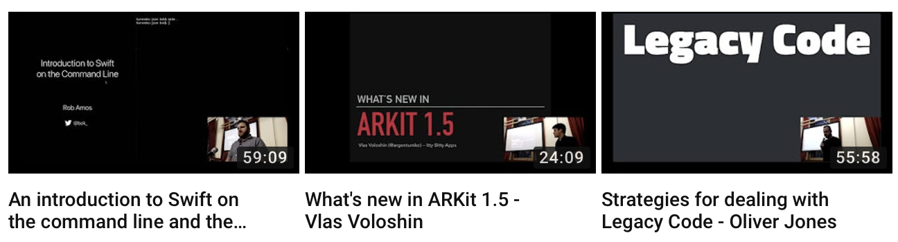

# Melbourne CocoaHeads
## July 12, 2018
### Join slack @ slack.melbournecocoaheads.com
### Twitter @melbournecocoa

---

# Melbourne CocoaHeads
## Kicking off @ 6:30pm
### Join slack @ slack.melbournecocoaheads.com
### Twitter @melbournecocoa
### Stickers up front!
---

# Welcome
# :wave:

---

# Welcome :wave:

- "Who's this guy?"
- Upcoming CocoaHeads events
- Code of Conduct
- Tonight's agenda & sponsors
- Who's hiring

---

# Hi, I'm Jesse

- Developing for iOS since 2010
- realestate.com.au, Beanhunter, RMIT
- Melbourne CocoaHeads organiser since ~2014

---

# Upcoming Events

- Hack Night - July 18th @ Cognizant
- Drinks Night - July 31st
- NS Breakfast - August 3rd
- /dev/world/2018 - August 26 - 28

---

# Finding CocoaHeads

- melbournecocoaheads.com
- twitter.com/@melbournecocoa
- slack.melbournecocoaheads.com
- melbournecocoaheads.com/live (YouTube)
- jesse@melbournecocoaheads.com

---

# CocoaHeads on YouTube

 - melbournecocoaheads.com/live

---

# Code of Conduct

---

> Our community is dedicated to providing an inclusive environment for everyone, regardless of gender, gender identity and expression, age, sexual orientation, disability, physical appearance, body size, race, ethnicity, religion (or lack thereof), or technology choices.

---

## melbournecocoaheads.com/code-of-conduct

---

## codeofconduct@melbournecocoaheads.com

^ All complaints made in any of these ways will remain confidential, be taken seriously, investigated, and dealt with appropriately.

---

# Sponsors for 2018

---

# Major Sponsor

---

# Silver Sponsors

---

# 2018 Venue

---

# Tonight's Agenda

Time|Speaker|Topic|
---|---|---
6:00 - 6:30 | Arrival and :pizza:
6:30 - 6:40 | Intro & Who's Hiring
6:45 - 7:15 | Vlas Voloshin | Marzipan's Internals
7:15 - 7:45 | Prasanna Gopalakrishnan | Architecture for Scaling Mobile
8:00        | Pub Time | Irish Times

---

# Who's Hiring
## Follow up -> #jobs

---

# Presentations

---

# Next Hack Night :computer:
## July 18 @ Cognizant from 6:00pm

---

# Next Drinks Night :beers:
## July 31 @ The Mill House from 6:00pm

# Next NSBreakfast :egg:
## August 3 @ Higher Ground from 7:30am

---

# Next Meetup 🗣
## August 9 @ YBF Ventures from 6:00pm

---

# To the Pub!
## The Irish Times - departing momentarily

---

# Thanks for Coming!
# melbournecocoaheads.com
