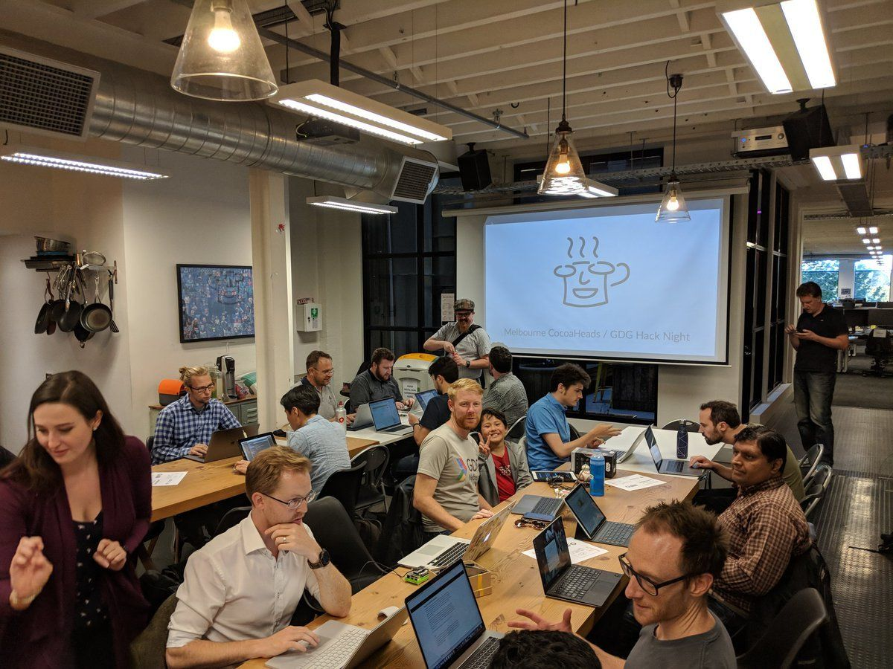
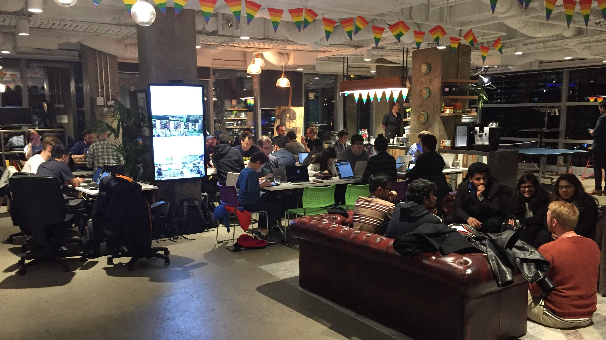

# Melbourne CocoaHeads 117
## August 9, 2018
### Join slack @ slack.melbournecocoaheads.com
### Twitter @melbournecocoa

---

# Melbourne CocoaHeads 117
## Kicking off @ 6:30pm
### Join slack @ slack.melbournecocoaheads.com
### Twitter @melbournecocoa
### Stickers up front!
---

# Welcome
# :wave:

^ Welcome, I'm Jesse, [stage left] this is Rob

---

# Welcome :wave:

- Code of Conduct
- Upcoming events
- Tonight's agenda & sponsors
- Who's hiring

---

# Code of Conduct

---

> Our community is dedicated to providing an inclusive environment for everyone, regardless of gender, gender identity and expression, age, sexual orientation, disability, physical appearance, body size, race, ethnicity, religion (or lack thereof), or technology choices.

---

## melbournecocoaheads.com/code-of-conduct

## codeofconduct@melbournecocoaheads.com

^ All complaints made in any of these ways will remain confidential, be taken seriously, investigated, and dealt with appropriately.

---

# Upcoming Events

- Hack Night - August 15th @ Cognizant
- Drinks Night - August 28th
- NS Breakfast - September 7th
- Melbourne GDG - August 29
- Melbourne AWS - August 29
- /dev/world/2018 - August 26 - 28

---

---

---

---

# Finding CocoaHeads

- melbournecocoaheads.com
- twitter.com/@melbournecocoa
- slack.melbournecocoaheads.com
- melbournecocoaheads.com/live (YouTube)
- jesse@melbournecocoaheads.com

---

# CocoaHeads on YouTube

 - melbournecocoaheads.com/live

---

# Sponsors for 2018

---

# Major Sponsor

---

# Silver Sponsors

---

# 2018 Venue

---

# Tonight's Agenda

Time|Speaker|Topic|
---|---|---
6:00 - 6:30 | Arrival and :pizza:
6:30 - 6:40 | Intro & Who's Hiring
6:45 - 7:15 | Audrey Tam | Getting started with Apple ML
7:15 - 7:30 | Break
7:30 - 8:00 | Renaud Lienhart | Demystifying self-sizing cells
8:00        | Pub Time | Irish Times

---

# Who's Hiring
## Follow up -> #jobs

---

# Presentations

---

# Next Hack Night :computer:
## August 15 @ Cognizant from 6:00pm

---

# Next Drinks Night :beers:
## August 28 @ The Mill House from 6:00pm

# Next NSBreakfast :egg:
## September 7 @ Higher Ground from 7:30am

---

# Next Meetup 🗣
## September 13 @ YBF Ventures from 6:00pm

---

# To the Pub!
## The Irish Times - departing momentarily

---

# Thanks for Coming!
# melbournecocoaheads.com
