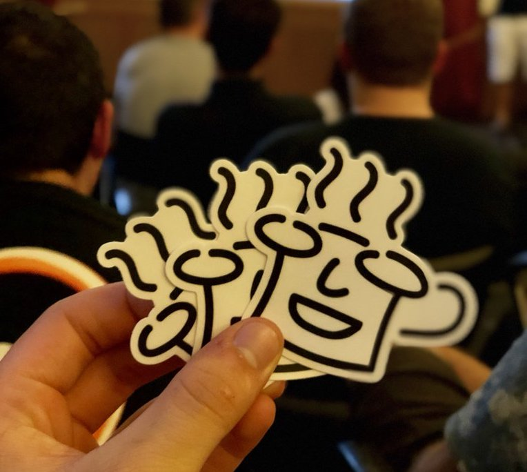
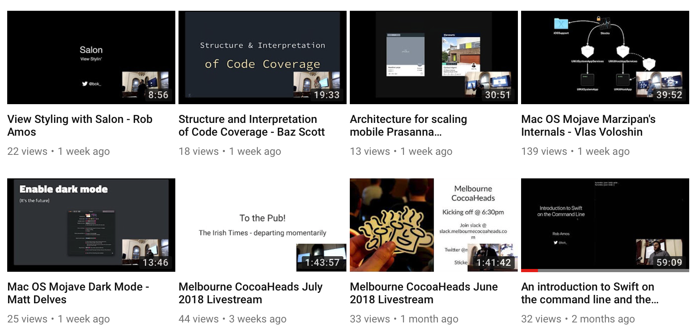
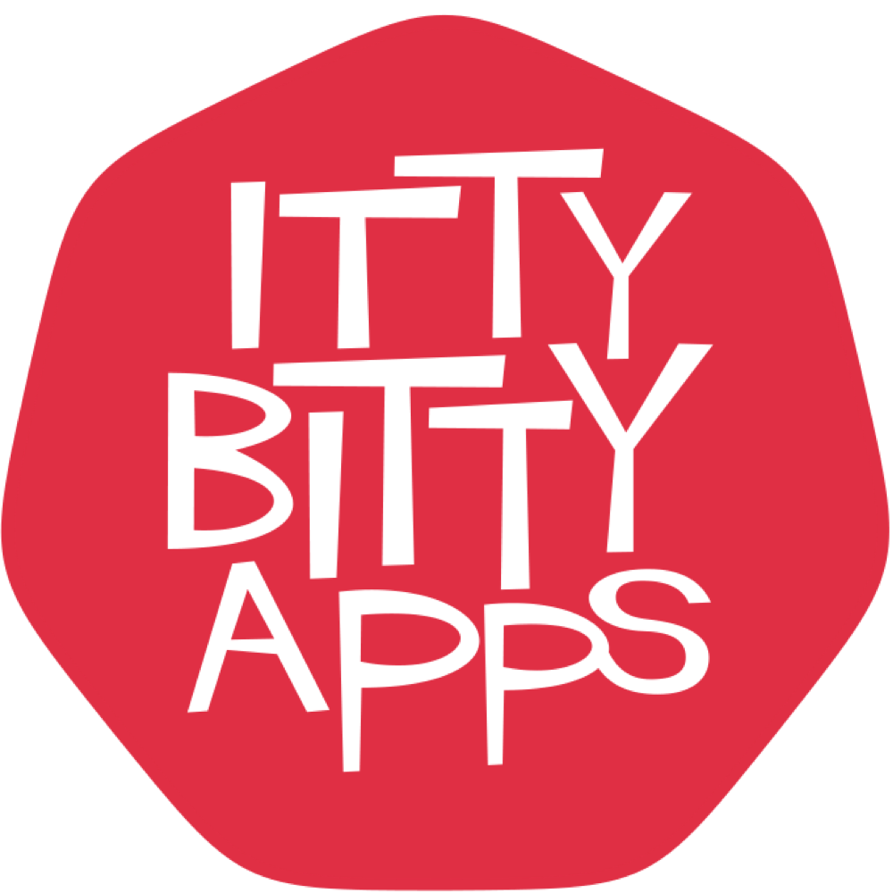
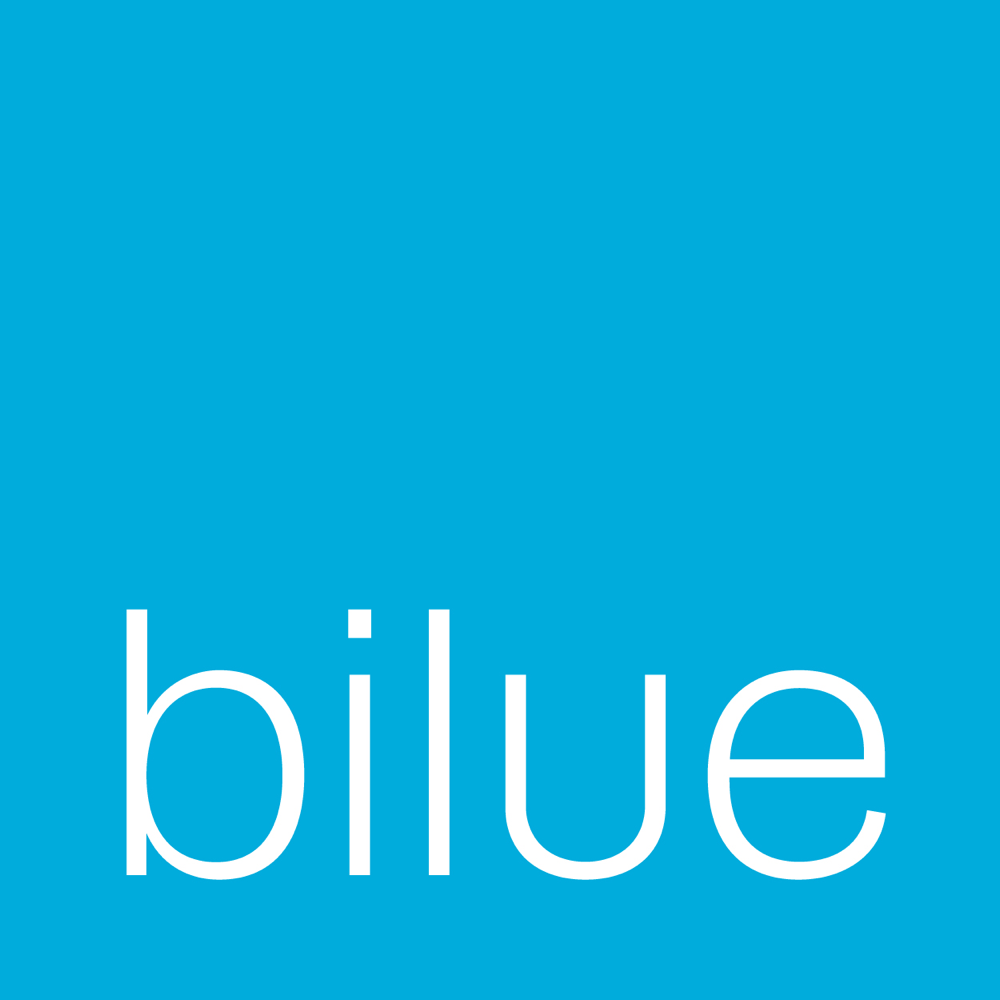
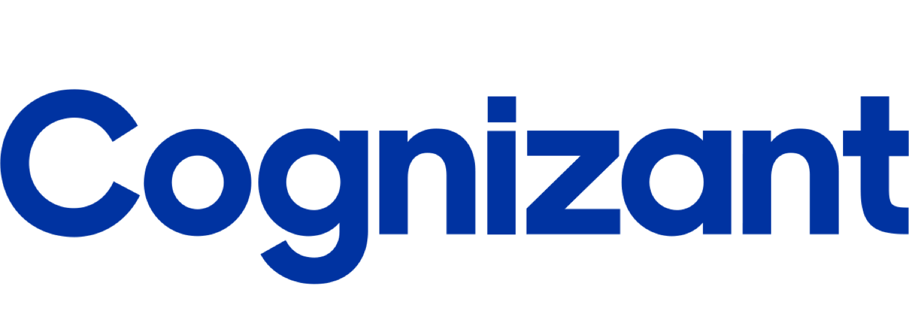

# Melbourne CocoaHeads 118
## September 13, 2018
### Join slack @ slack.melbournecocoaheads.com
### Twitter @melbournecocoa

---

# Melbourne CocoaHeads 118
## Kicking off @ 6:30pm
### Join slack @ slack.melbournecocoaheads.com
### Twitter @melbournecocoa
### Stickers up front!
---

# Welcome
# :wave:

^ Welcome, I'm Jesse, [stage left] this is Rob

---

# Welcome :wave:

- Code of Conduct
- Upcoming events
- Tonight's agenda & sponsors
- Who's hiring

---

# Code of Conduct

---

> Our community is dedicated to providing an inclusive environment for everyone, regardless of gender, gender identity and expression, age, sexual orientation, disability, physical appearance, body size, race, ethnicity, religion (or lack thereof), or technology choices.

---

## melbournecocoaheads.com/code-of-conduct

## codeofconduct@melbournecocoaheads.com

^ All complaints made in any of these ways will remain confidential, be taken seriously, investigated, and dealt with appropriately.

---

# Upcoming Events

- Hack Night - September 19 @ Cognizant
- Drinks Night - September 25
- NS Breakfast - October 5th
- Melbourne GDG - August 26
- Melbourne AWS - August 26
- GDG Devfest - October 27

---

# GDG Devfest

https://www.gdgmelbourne.com/devfest-2018/

Mobile - Android, Flutter.io, AR, IOT (Android Things)
ML - AI, Machine Learning
Web - Angular

---

---

---

---

# Finding CocoaHeads

- melbournecocoaheads.com
- twitter.com/@melbournecocoa
- slack.melbournecocoaheads.com
- melbournecocoaheads.com/live (YouTube)
- jesse@melbournecocoaheads.com

---

# CocoaHeads on YouTube

 - melbournecocoaheads.com/live

---

# Sponsors for 2018

---

# Major Sponsor

---

# Silver Sponsors

---

# 2018 Venue

---

# Tonight's Agenda

Time|Speaker|Topic|
---|---|---
6:00 - 6:30 | Arrival and :pizza:
6:30 - 6:50 | Intro, Gather Round, #til
6:50 - 7:30 | Gerald Kim | USDZ Format
7:45 | Pub Time | Irish Times

---

# Who's Hiring
## Follow up -> #jobs

---

# Presentations

---

# Next Hack Night :computer:
## September 19 @ Cognizant from 6:00pm

---

# Next Drinks Night :beers:
## September 25 @ The Mill House from 6:00pm

# Next NSBreakfast :egg:
## October 5 @ Higher Ground from 7:30am

---

# Next Meetup 🗣
## September 13 @ YBF Ventures from 6:00pm

---

# To the Pub!
## The Irish Times - departing momentarily

---

# Thanks for Coming!
# melbournecocoaheads.com
