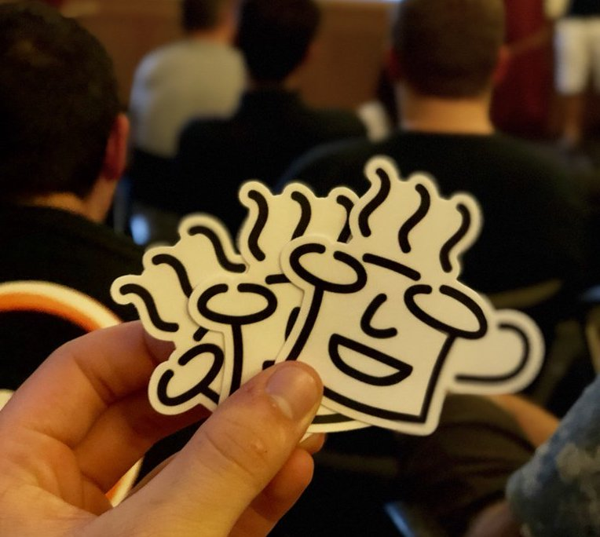
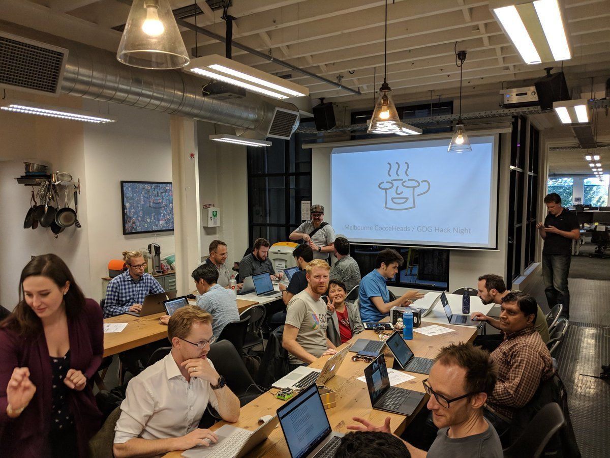
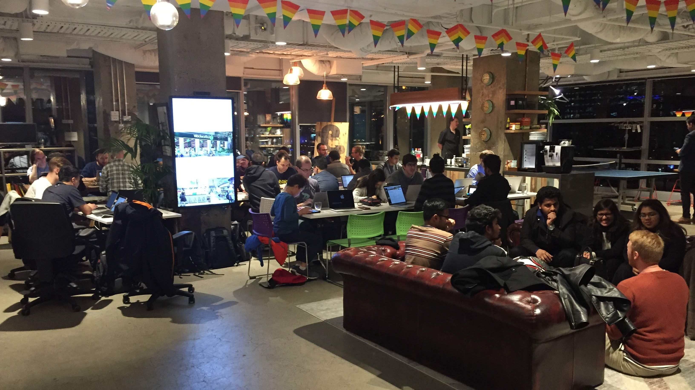
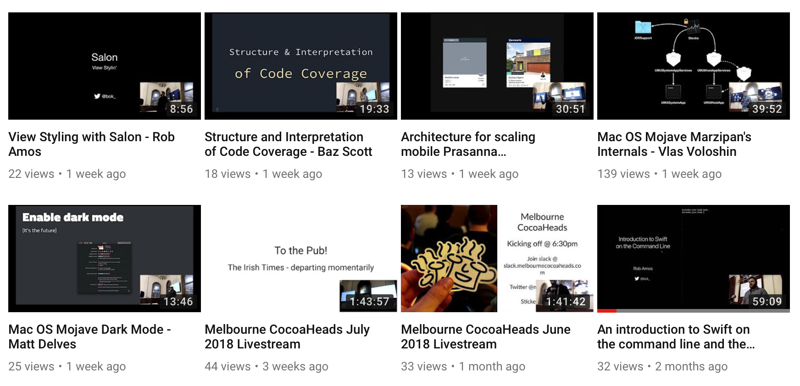
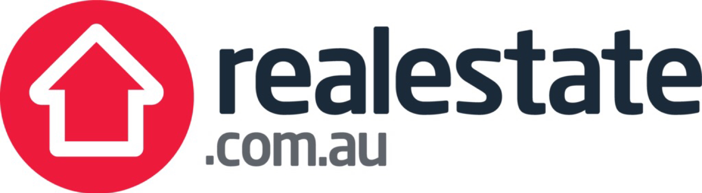
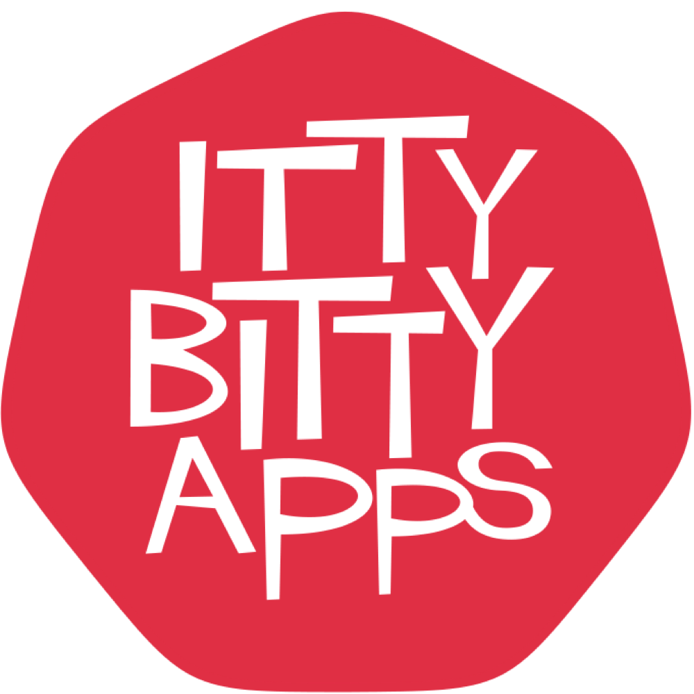
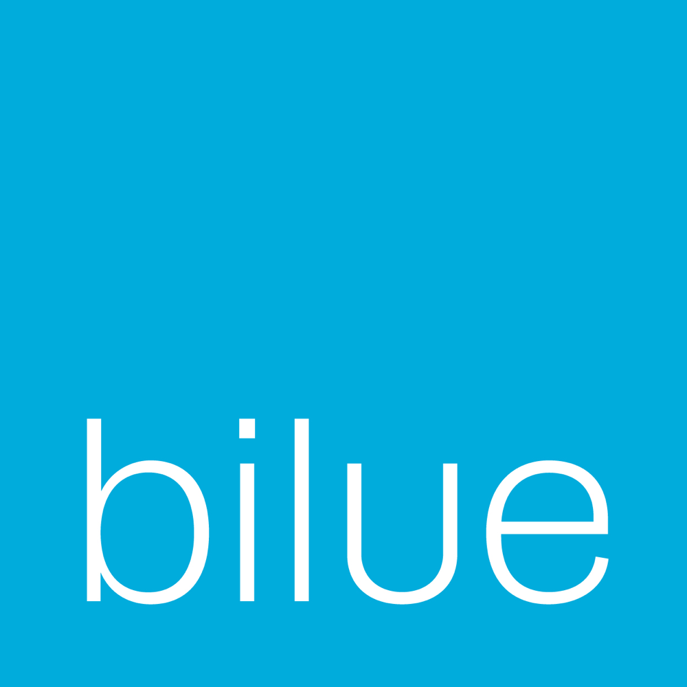
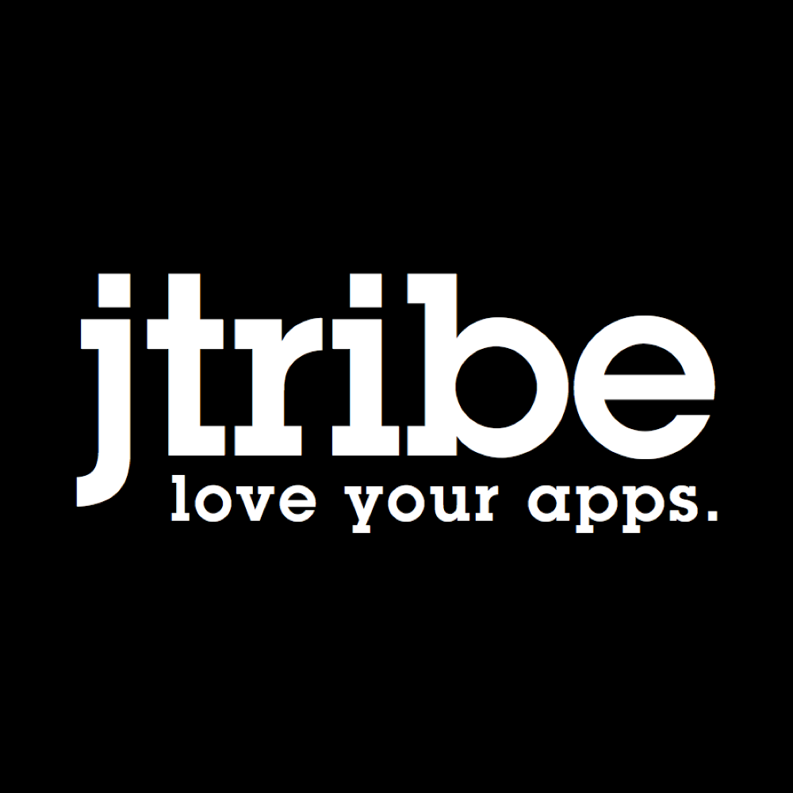
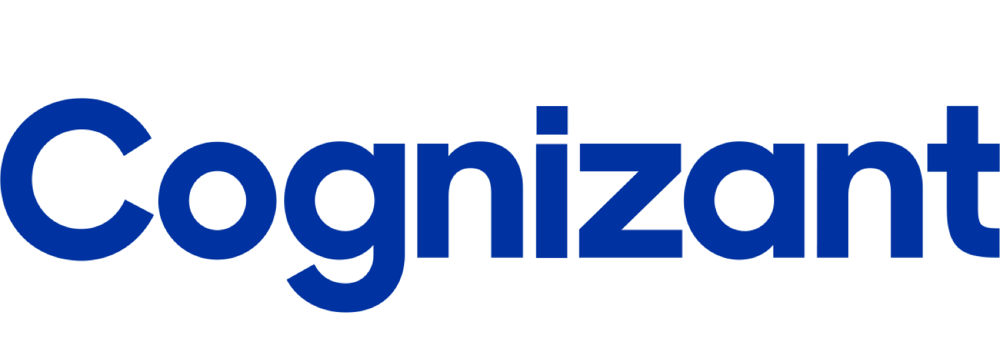
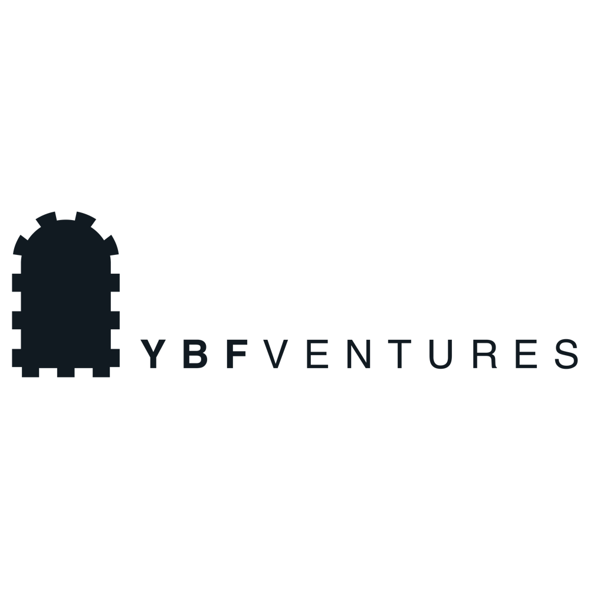

# Melbourne CocoaHeads 119
## October 11, 2018
### Join slack @ slack.melbournecocoaheads.com
### Twitter @melbournecocoa

---

# Melbourne CocoaHeads 119
## Kicking off @ 6:30pm
### Join slack @ slack.melbournecocoaheads.com
### Twitter @melbournecocoa
### Stickers up front!
---

# Welcome
# :wave:

^ Welcome, I'm Jesse, [stage left] this is Rob

---

# Welcome :wave:

- Code of Conduct
- Upcoming events
- Tonight's agenda & sponsors
- Who's hiring

---

# Code of Conduct

---

> Our community is dedicated to providing an inclusive environment for everyone, regardless of gender, gender identity and expression, age, sexual orientation, disability, physical appearance, body size, race, ethnicity, religion (or lack thereof), or technology choices.

---

## melbournecocoaheads.com/code-of-conduct

## codeofconduct@melbournecocoaheads.com

^ Kate Lanyon, Jesse Collis, Ben Deckys, Sean Woodhouse, Jony Sagorin

^ All complaints made in any of these ways will remain confidential, be taken seriously, investigated, and dealt with appropriately.

---

# Upcoming Events

- Hack Night - October 17 @ Cognizant
- Drinks Night - October 30D
- NS Breakfast - November 2
- GDG Devfest - October 27
- Melbourne AWS - October 31

---

# GDG Devfest

https://www.gdgmelbourne.com/devfest-2018/

Mobile - Android, Flutter.io, AR, IOT (Android Things)
ML - AI, Machine Learning
Web - Angular

---

---

# Finding CocoaHeads

- melbournecocoaheads.com
- twitter.com/@melbournecocoa
- slack.melbournecocoaheads.com
- melbournecocoaheads.com/live (YouTube)
- jesse@melbournecocoaheads.com

---

# CocoaHeads on YouTube

 - melbournecocoaheads.com/live

---

# Sponsors for 2018

---

# Major Sponsor

---

# Silver Sponsors

---

# 2018 Venue

---

# Tonight's Agenda

Time|Speaker|Topic|
---|---|---
6:00 - 6:30 | Arrival and :pizza:
6:30 - 6:40 | Jesse Collis | Welcome
6:40 - 7:10 | Pablo Caif | Getting connected with CoreNFC
7:10 - 7:20 | Edward Greenaway | NS[Spain]	 and Mobiconf overview
7:30 - 7:45 | Jean Etienne | The current CI/CD landscape
7:45 - 8:00 | Jesse Collis | #til October 2018
8:00 | Pub Time | Irish Times

---

# Who's Hiring
## Follow up -> #jobs

---

# Presentations

---

# Next Hack Night :computer:
## October 17 @ Cognizant from 6:00pm

---

# Next Drinks Night :beers:
## October 30 @ The Mill House from 6:00pm

# Next NSBreakfast :egg:
## November 2 @ Higher Ground from 7:30am

---

# Next Meetup 🗣
## November 8 @ YBF Ventures from 6:00pm

---

# To the Pub!
## The Irish Times - departing momentarily

---

# Thanks for Coming!
# melbournecocoaheads.com
