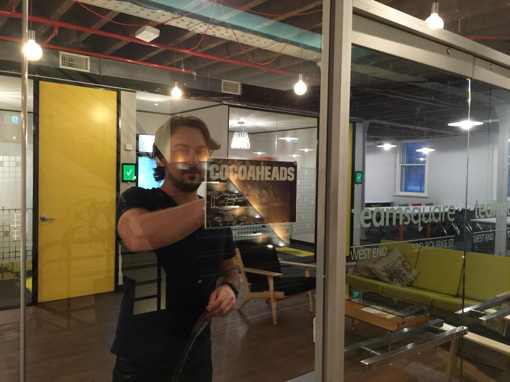

# Melbourne CocoaHeads 123
## March 14, 2019
### Join slack @ slack.melbournecocoaheads.com
### Twitter @melbournecocoa

---

# Melbourne CocoaHeads 123
## Kicking off @ 6:30pm
### Join slack @ slack.melbournecocoaheads.com
### Twitter @melbournecocoa
### Stickers up front!
---

# Welcome
# :wave:

^ Welcome, I'm Jesse, [stage left] this is Rob

---

# Hi, I'm Jesse

- iOS developer since 2009
- Melbourne CocoaHeads organiser since ~2014

---

# Welcome :wave:

- Code of Conduct
- Upcoming events
- Tonight's agenda & sponsors
- Who's hiring

---

# Code of Conduct

---

> Our community is dedicated to providing an inclusive environment for everyone, regardless of gender, gender identity and expression, age, sexual orientation, disability, physical appearance, body size, race, ethnicity, religion (or lack thereof), or technology choices.

---

## melbournecocoaheads.com/code-of-conduct

## codeofconduct@melbournecocoaheads.com

^ Kate Lanyon, Jesse Collis, Ben Deckys, Sean Woodhouse, Jony Sagorin

^ All complaints made in any of these ways will remain confidential, be taken seriously, investigated, and dealt with appropriately.

---

# CocoaHeads Events

- Presentation Night
- Hack Night
- Drinks Night & NSBreakfast

---

# Presentation Night

- 2nd Thursday, 6pm-8:30pm
- :pizza: and drinks from 6pm
- Lightning talks (~10 mins)
- Main presentation (~20 mins)
- Livestreamed to YouTube
- Hosted at YBF Ventures, 520 Bourke St

---

# Hack Night

- Introductions from 6:30pm
- BYO laptop and your iOS, macOS, tvOS, watchOS Android project
- Alchohol free, :pizza: provided
- Hosted at Cognizant Digital Business, 15 William St. 

---

---

# Upcoming Events

- Hack Night - February 20 @ Cognizant
- Drinks Night - February 26
- NS Breakfast - March 1
- Google Developers Group - February 27 

---

# Finding CocoaHeads

- melbournecocoaheads.com
- twitter.com/@melbournecocoa
- slack.melbournecocoaheads.com
- melbournecocoaheads.com/live (YouTube)
- jesse@melbournecocoaheads.com

---

# #Volunteers

- Would you like to Present?
- Would you like to help out?
- Join in on slack

---

# CocoaHeads on YouTube

 - melbournecocoaheads.com/live

---

# Sponsors for 2019

---

# Major Sponsor

---

# Silver Sponsors

- Appscore
- Domestic Cat Software
- Itty Bitty Apps
- Latitude Financial

---

# 2019 Venue

---

# Tonight's Agenda

Time|Speaker|Topic|
---|---|---
6:40 - 7:10 | Pablo Caif | Custom View Controller Presentations
7:15 - 7:30 | Renaud Lienhard | Unit Testing Memory Leaks
7:30 - 7:45 | Quick Break
7:45 - 7:55 | Baz | TBC
7:55 - 8:05 | Jesse | xcodebuild
8:15 | 🍻 | Irish Times

---

# Who's Hiring
## Follow up -> #jobs

---

# Presentations

---

# Next Hack Night :computer:
## March 14 @ Cognizant from 6:00pm

---

# Next Drinks Night :beers:
## March 26 @ Imperial Hotel (Bourke/Spring St) from 6:00pm

# Next NSBreakfast :egg:
## April 5 @ Higher Ground from 7:30am

---

# Next Meetup 🗣
## March 14 @ YBF Ventures from 6:00pm

---

# To the Pub!
## The Irish Times - departing momentarily

---

# Thanks for Coming!
# melbournecocoaheads.com
