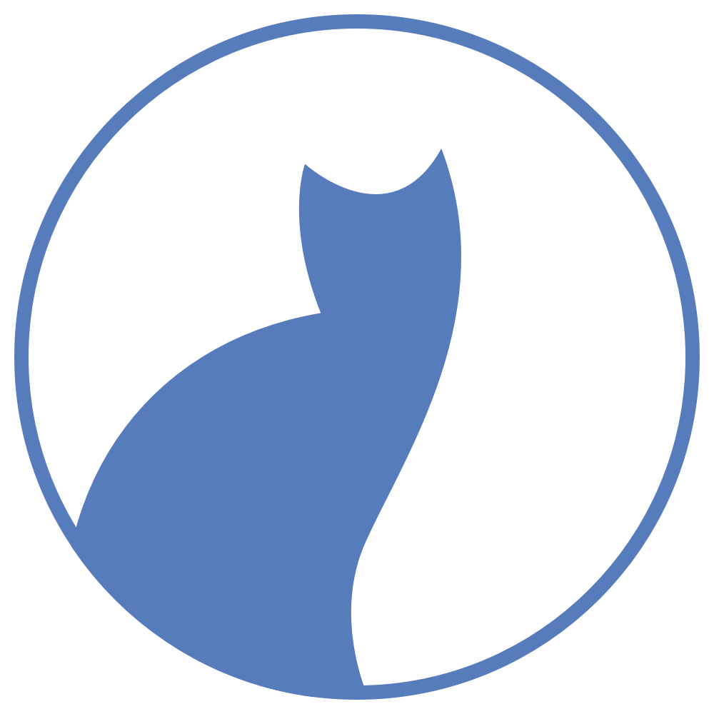
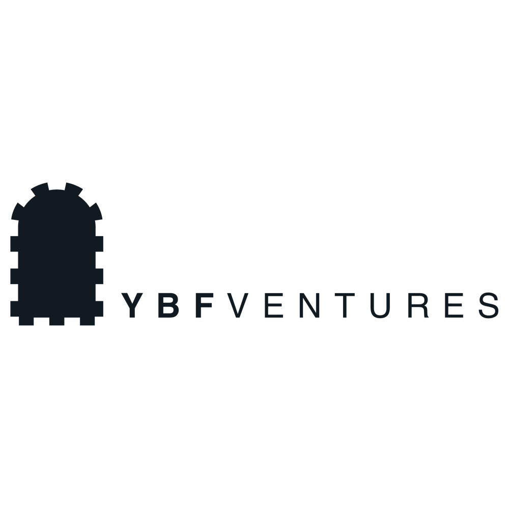

# Melbourne CocoaHeads 124
## April 11, 2019
### Join slack @ slack.melbournecocoaheads.com
### Twitter @melbournecocoa

---

# Melbourne CocoaHeads 124
## Kicking off @ 6:30pm
### Join slack @ slack.melbournecocoaheads.com
### Twitter @melbournecocoa
### Stickers up front!
---

# Welcome
# :wave:

^ Welcome, I'm Jesse, [stage left] this is Rob

---

# Hi, I'm Jesse

- iOS developer since 2009
- Melbourne CocoaHeads organiser since ~ 2014

---

# Welcome :wave:

- Code of Conduct
- Upcoming events
- Tonight's agenda & sponsors
- Who's hiring

---

# Code of Conduct

---

> Our community is dedicated to providing an inclusive environment for everyone, regardless of gender, gender identity and expression, age, sexual orientation, disability, physical appearance, body size, race, ethnicity, religion (or lack thereof), or technology choices.

---

# Asking great questions

- Ask questions not comments
- Make questions polite that contribute to the discussion
- Nobody knows all the answers!

^ Many of our speakers take questions after their talk. Question time an opportunity to learn more, not to get up and share your own opinion - So please ask concise questions, not give comments. 

^ Good questions should contribute to the discussion and allow us all to learn. Our speakers are knowledgeable, but they don’t know everything, so “I don’t know” is always an acceptable answer.  

^ Audience members shouldn’t try and catch out the speakers with a difficult questions they can’t answer. Instead be supportive of speakers.

^ There are many opportunities after the talks or on slack to chat to the speaker and discuss your question or thoughts further. Please approach the speaker with respect when you do this and understand if they cannot have a full discussion at that time.

---

## melbournecocoaheads.com/code-of-conduct

## codeofconduct@melbournecocoaheads.com

^ Kate Lanyon, Jesse Collis, Ben Deckys, Sean Woodhouse, Jony Sagorin

^ All complaints made in any of these ways will remain confidential, be taken seriously, investigated, and dealt with appropriately.

---

# Upcoming Events

---

# CocoaHeads Next

- I am stepping down after the July event
- Looking for help to share responsibilities and chape CocoaHeads going forward
- CocoaHeads Planning Meeting for 2019 and beyond 16/4/19
- RSVP on meeteup

---

# Upcoming Events

- Hack Night - April 17 @ Cognizant
- Drinks Night - April 30
- Google Developers Group - April 24 

---

# Hack Night

- Doors open at 6:00pm
- Introductions from 6:30pm
- BYO laptop and your iOS, macOS, tvOS, watchOS Android project
- Alchohol free, :pizza: provided
- Hosted at Cognizant Digital Business, 15 William St. 

---

---

# Finding CocoaHeads

- melbournecocoaheads.com
- twitter.com/@melbournecocoa
- slack.melbournecocoaheads.com
- youtube.com/c/MelbourneCocoaHeads
- jesse@melbournecocoaheads.com

---

# #Volunteers

- Would you like to Present?
- Would you like to help out?
- Join in on slack

---

# CocoaHeads on YouTube

 - youtube.com/c/MelbourneCocoaHeads

---

# Sponsors for 2019

---

# Major Sponsor

---

# Silver Sponsors

---

# 2019 Venue

---

# Tonight's Agenda

Time|Speaker|Topic|
---|---|---
6:40 - 6:55| Peter Goldsmith | The Month That Was (TMTW)
7:00 - 7:25 | Kevin O'neal | iOS and TEA 
7:25 - 7:40 | Break
7:40 - 8:00 | Prasanna G | Moving to weekly Release Trains 
8:05 - 8:30 | Jordan Mazurke | Hack your way to a secure app
8:30 | 🍻 | Irish Times

---

# Who's Hiring
## Follow up -> #jobs

---

# Presentations

---

# Next Hack Night :computer:
## April 17 @ Cognizant from 6:00pm

---

# Next Drinks Night :beers:
## April 30 @ Imperial Hotel (Bourke/Spring St) from 6:00pm

---

# Next Meetup 🗣
## May 9 @ YBF Ventures from 6:00pm

---

# To the Pub!
## The Irish Times - departing momentarily

---

# Thanks for Coming!
# melbournecocoaheads.com
