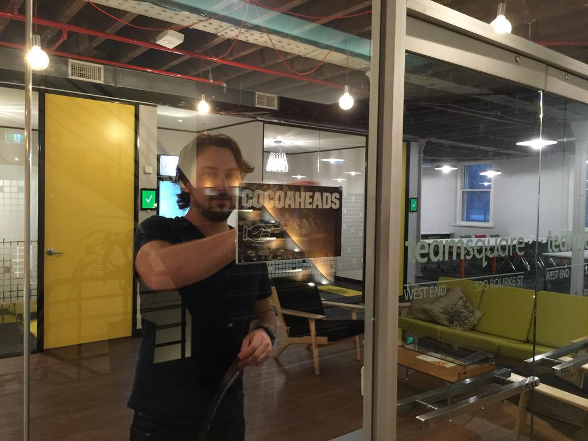
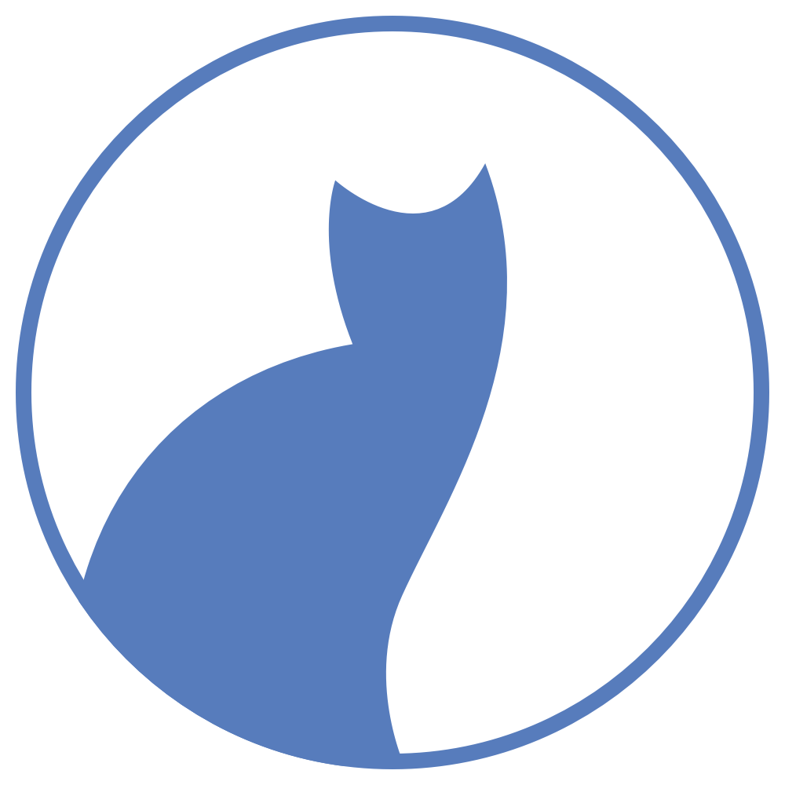

# Melbourne CocoaHeads 125
## May 8th, 2019
### Join slack @ slack.melbournecocoaheads.com
### Twitter @melbournecocoa

---

# Melbourne CocoaHeads 125
## Kicking off @ 6:30pm
### Join slack @ slack.melbournecocoaheads.com
### Twitter @melbournecocoa
### Stickers up front!
---

# Welcome
# :wave:

^ Welcome, I'm Jesse, [stage left] this is Rob

---

# Hi, I'm Jesse

- iOS developer since 2009
- Melbourne CocoaHeads organiser since ~ 2014 -> 2019

---

# Welcome :wave:

- Code of Conduct
- Upcoming events
- Tonight's agenda & sponsors
- Who's hiring

---

# Code of Conduct

---

> Our community is dedicated to providing an inclusive environment for everyone, regardless of gender, gender identity and expression, age, sexual orientation, disability, physical appearance, body size, race, ethnicity, religion (or lack thereof), or technology choices.

---

### melbournecocoaheads.com/code-of-conduct

### codeofconduct@melbournecocoaheads.com

^ Kate Lanyon, Jesse Collis, Ben Deckys, Sean Woodhouse, Jony Sagorin

^ All complaints made in any of these ways will remain confidential, be taken seriously, investigated, and dealt with appropriately.

---

# Asking great questions

- Ask questions not comments
- Make questions polite that contribute to the discussion
- Nobody knows all the answers!

^ Many of our speakers take questions after their talk. Question time an opportunity to learn more, not to get up and share your own opinion - So please ask concise questions, not give comments. 

^ Good questions should contribute to the discussion and allow us all to learn. Our speakers are knowledgeable, but they don’t know everything, so “I don’t know” is always an acceptable answer.  

^ Audience members shouldn’t try and catch out the speakers with a difficult questions they can’t answer. Instead be supportive of speakers.

^ There are many opportunities after the talks or on slack to chat to the speaker and discuss your question or thoughts further. Please approach the speaker with respect when you do this and understand if they cannot have a full discussion at that time.

---

# CocoaHeads - Next

- Transition Meetup was held on April 16th
- TL;DR:
    - We're moving towards a more distributed approach (distributed systems are more resilient 🤓)
    - Rotating event-based team, more people involved
    - Dedicated team of advocates to reach out to Students and Juniors
    - Anyone can be a MC!

---

# Upcoming Events

---

# Upcoming Events

- Hack Night 
    -> May 15th @ Cognizant
- Google Developers Group (IO Special Event) 
    -> May 23rd @ AusPost
- Drinks Night 
    -> May 28th @ Imperial Hotel (opposite Parliament House)

---

# Hack Night

- Doors open at 5:45pm
- Introductions from 6:15pm
- BYO laptop and your iOS, macOS, tvOS, watchOS, Android project
- Alchohol free, :pizza: (maybe also 🍣) provided
- Hosted at Cognizant Digital Business, 15 William St. 

---

---

# Finding CocoaHeads

- melbournecocoaheads.com
- twitter.com/@melbournecocoa
- slack.melbournecocoaheads.com
- youtube.com/c/MelbourneCocoaHeads

---

# #Volunteers

- Would you like to Present?
- Would you like to help out?
- Join in on slack

---

# CocoaHeads on YouTube

 - youtube.com/c/MelbourneCocoaHeads

---

# Sponsors for 2019

---

# Major Sponsor

---

# Silver Sponsors

---

# 2019 Venue

---

# Tonight's Agenda

Time|Speaker|Topic|
---|---|---
6:40 - 6:55 | Jayan Varma  | What's new in Swift 5.0
7:00 - 7:25 | Adam Weiss   | Using video to expand the reach of your app
7:25 - 7:40 | Break
8:30 | 🍻 | Irish Times

---

# Who's Hiring
## Follow up -> #jobs

---

# Presentations

---

# Next Hack Night :computer:
## May 15th @ Cognizant from 6:00pm

---

# Next Drinks Night :beers:
## May 28th @ Imperial Hotel (Bourke/Spring St) from 6:00pm

---

# Next Meetup 🗣
## June 13th @ YBF Ventures from 5:45pm

---

# To the Pub!
## The Irish Times - departing momentarily

---

# Thanks for Coming!
# melbournecocoaheads.com
